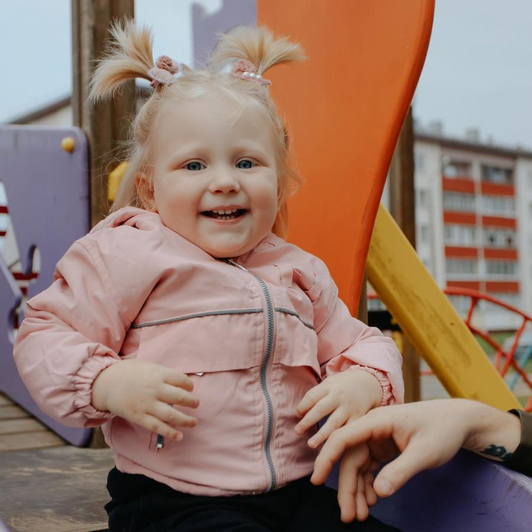

<h1 align="center">Минт NFT Save Sofia [zkSync] </h1>

### Все средства от минта пойдут на лечение малышки Софии
### Минт 1 NFT ~ 1.5$ (https://omnisea.org/1YzWfevRxbznt3WWTKJ1)



Софии 1 год и 11 месяцев и она смертельно больна (диагноз - СМА 2 типа), но всего лишь один укол Zolgensma стоимостью 2.000.000$ может помочь ей **ПОЛНОСТЬЮ** вылечиться.

Сделать этот укол можно ТОЛЬКО до того, как Софии исполнится 2 года - 28.10.2023.

> [!Важно]
> Осталось меньше 20 дней.

Общими усилиями на момент создания этой NFT (10 октября 2023 года) собрано порядка 135.000$.

Давайте вместе объединимся и подарим жизнь этой замечательной девочке!

Все средства от минта NFT будут переданы мной лично (https://t.me/isartem) семье Софии на лечение!

---

Sofia is 1 year and 11 months old and terminally ill (diagnosed with CMA type 2), but just one $2,000,000 Zolgensma shot can help her FULLY recover.

This shot can ONLY be given before Sofia turns 2 years old on 10/28/2023.

There are less than 20 days left.

With our combined efforts, about $135,000 has been raised as of the creation of this NFT (October 10, 2023).

Let's join together and give life to this wonderful little girl!

All funds from the NFT will be donated by me personally (https://t.me/isartem) to Sofia's family for treatment! 

---
<h2>Что я могу предложить от себя взамен в качестве благодарности за Вашу помощь?</h2>

```
** При минте от 3 NFT **

На выбор:

- Любой скрипт из моего магазина (доступен в Телеграм-боте, https://t.me/isartem_bot)

- PRO-доступ к Телеграм-боту для аналитики zkSync-кошельков, 3 мес. (https://t.me/sibil_robot)

- PDF-методичку из трех частей для самостоятельной разработки Telegram-бота с ИИ-ассистентом от OpenAI на Python
```

Чтобы получить бонус после минта NFT, необходимо заполнить форму:
https://forms.gle/jD7spzdFkv8HQasK9

<h2>Почему я запустил этот минт?</h2>
```
Занимаясь AirDrop'ами, приходится ежедневно сжигать кучу "газа" только лишь для того, чтобы
на "накрутить" статистику своих аккаунтов в надежде получить заветный "дроп".

Я не смог пройти мимо беды, которая пришла в семью Софии, и прекрасно понимаю, что самостоятельно
они точно не смогут собрать такую внушительную сумму на лечение Сони - 2.000.000$.

По состоянию на 

И тут мне пришла идея предложить Вам, уважаемые ретрохантеры, Win-Win идею, которая реализована в виде
минта NFT Save Sofia с приложением скрипта на Python, чтобы можно было быстро сминтить NFT на необходимом
количестве своих кошельков и тем самым:

1. Помочь семье Софии хотя бы приблизиться к заветной сумме, чтобы их доченька смогла ЖИТЬ
2. А бонусом получаете от меня любой бонус (на выбор), а также прогреваете свои ретро-аккаунты, взаимодействуя
   с новым контрактом в сети zkSync Era.
```

<h2>Какой порядок действий?</h2>
```
1. Средства с каждого минта поступают на zkSync-кошелек (0x00e8a535E1f9Bd33E66293a1863bc5905AE57545)
2. На момент старта на кошельке находится 0.001339917411348764 ETH
3. Минт продлится 2 недели, до 12:00 ч. 24.10.2023 г.
4. После ВСЕ полученные от минта NFT средства будут обменяны на USDT и переданы семье Софии на ее лечение
```
<h2>Запуск скрипта</h2>

```
git clone https://github.com/Birzha76/save-sofia-nft

cd save-sofia-nft

pip install -r requirements.txt

python main.py

После запуска необходимо ввести в терминале количество NFT, которые Вы хотите сминтить на каждом кошельке.
```


<h2>Настройка</h2>

```
1) Все основные настройки производятся в файле settings.py (в файле есть комментарии для каждой настройки)

2) В файле accounts.txt размещаем свои приватные ключи от zkSync-кошельков (каждый с новой строки)

3) В файле rpc.json по пути zksync/data/rpc.json можем менять RPC на свои
```

<h2>Информация про Софию и ее болезнь</h2>

* Instagram: https://www.instagram.com/sofia_sma2_help/
* Taplink: https://taplink.cc/sofia_sma2
* Документы Софии: https://drive.google.com/drive/folders/11oW0RGkO0gX6lnpzt4ERujoJoMfutZsO

<h2>Инфлы, присоединяйтесь!</h2>

Без вашей помощи мы навряд ли сможем собрать какую-то ощутимую сумму, поэтому буду рад любой
посильной помощи. Связаться со мной можно по следующим контактам:

* **Telegram**: https://t.me/birzha76
* **Email**: artem.development@gmail.com

Открыт к любым Вашим предложениям и идеям.

<h2>Отдельная благодарность</h2>

| Кому                               | За что                                             |
|------------------------------------|----------------------------------------------------|
| [czbag](https://github.com/czbag) | Скрипт zkSync, который был взят за основу          |